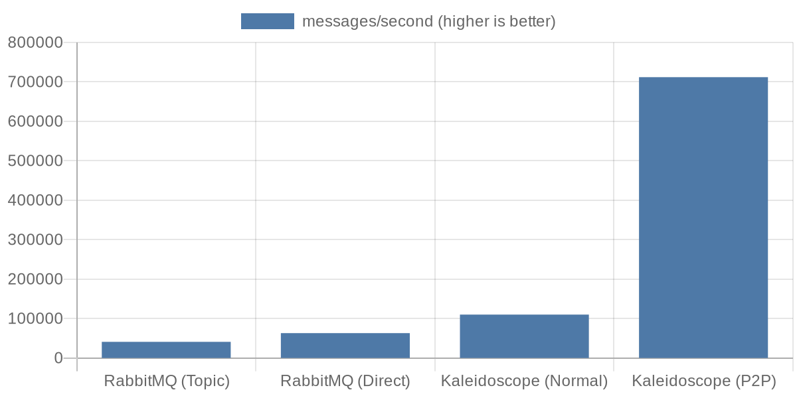
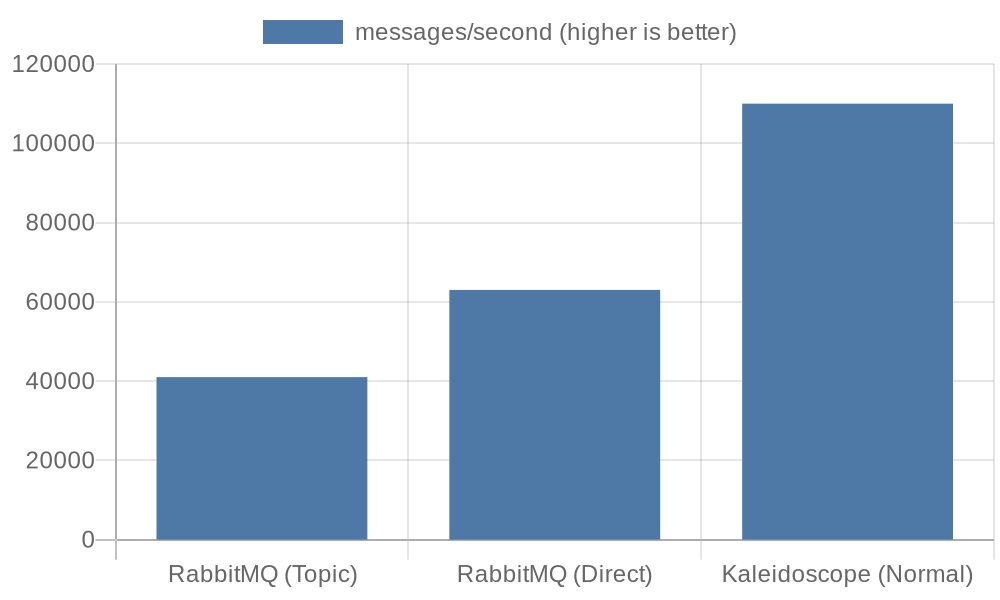
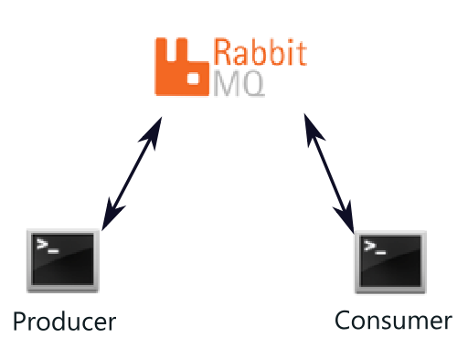
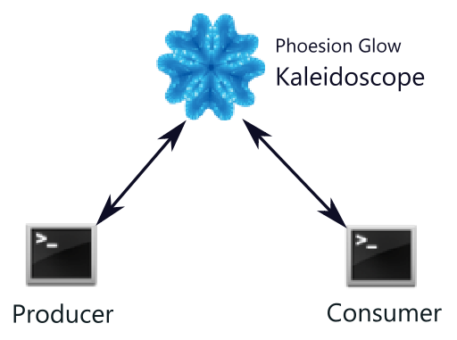
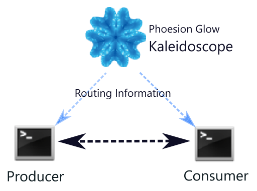

# Phoesion Glow Kaleidoscope message broker benchmarking

Welcome to the **[Phoesion Glow](https://glow.phoesion.com) Kaleidoscope** message broker benchmarking repository!
This repository is where I benchmark the performance of the Kaleidoscope against other popular message brokers, starting with RabbitMQ.

## Table of Contents

- [Phoesion Glow Kaleidoscope message broker benchmarking](#phoesion-glow-kaleidoscope-message-broker-benchmarking)
	- [Table of Contents](#table-of-contents)
	- [Introduction](#introduction)
	- [Benchmarking Methodology](#benchmarking-methodology)
	- [Results](#results)
		- [Charts](#charts)
	- [Getting Started](#getting-started)
		- [Installation](#installation)
		- [Running Benchmarks](#running-benchmarks)
	- [Topology](#topology)
	- [Contributing](#contributing)
	- [License](#license)
	- [Contact](#contact)

## Introduction

This repository contains the necessary scripts and tools to perform benchmarking tests comparing the Phoesion Glow Kaleidoscope message broker with other brokers. The main focus is on evaluating performance metrics like message throughput, latency, and resource utilization.

Currently, the benchmarking tests compare Kaleidoscope with RabbitMQ, but I plan to add more message brokers in the future.

## Benchmarking Methodology

To ensure fair and consistent comparisons, the benchmarks are conducted in controlled environments with identical configurations. The key performance metrics evaluated are:

- **Message Throughput**: Number of messages processed per second.
- **Latency**: Time taken to deliver a message from producer to consumer.
- **Resource Utilization**: CPU and memory usage during peak loads.

## Results

The benchmark tests yielded the following results:

RabbitMQ - Topic exchange:
- Message Throughput: **40,000** messages/second
- Latency: 80ms for the first message to arrive

RabbitMQ - Direct exchange:
- Message Throughput: **60,000** messages/second
- Latency: 80ms for the first message to arrive

Kaleidoscope - Normal mode:
- Message Throughput: **140,000** messages/second
- Latency: 0ms for the first message to arrive

Kaleidoscope - P2P Mode:
- Message Throughput: **710,000** messages/second
- Latency: 0ms for the first message to arrive

These results highlight a significant performance advantage for Kaleidoscope, especially in P2P mode.


### Charts


Another chart without Kaleidoscope P2P mode, comparing the performance using the same topology



## Getting Started

Follow these instructions to set up the benchmarking environment and run the tests.

### Installation

1. Clone this repository to your local machine:
    ```bash
    git clone git@github.com:gepa21/broker_benchmark.git
    cd broker_benchmark
    ```

2. [Download the Phoesion Glow Kaleidoscope portable app archive](https://packages.phoesion.com/phoesion.glow/dists/win/main/versions/2.0.5/binary-amd64/Phoesion.Glow.Kaleidoscope_2.0.5.zip) and run the **Phoesion.Glow.Kaleidoscope.exe** executable


3. Build the Docker images for RabbitMQ:
    ```bash
    docker-compose build
    ```

4. Start the message brokers using Docker Compose:
    ```bash
    docker-compose up -d
    ```

### Running Benchmarks

1. Run the benchmarking project using:
    ```bash
    dotnet run -c Release --project benchmark\Benchmark.csproj
    ```

2. Select broker and press any key to run the benchmark
   
3. Run it a few times to allow JIT to optimize


## Topology

These diagrams show how data move in different setups:
- RabbitMQ using Topic/Direct exchanges. \

- Kaleidoscope in Normal mode. \

- Kaleidoscope in P2P mode. \



## Contributing

I welcome contributions to enhance the benchmarking framework, add support for more message brokers, and improve the analysis tools. Please fork this repository and submit pull requests with your changes.

## License

This project is licensed under the MIT License - see the [LICENSE](LICENSE) file for details.

## Contact

If you have any questions, suggestions, or feedback, please feel free to open an issue.

---

Thank you for your interest in [Phoesion Glow](https://glow.phoesion.com/). I look forward to your contributions and feedback!
